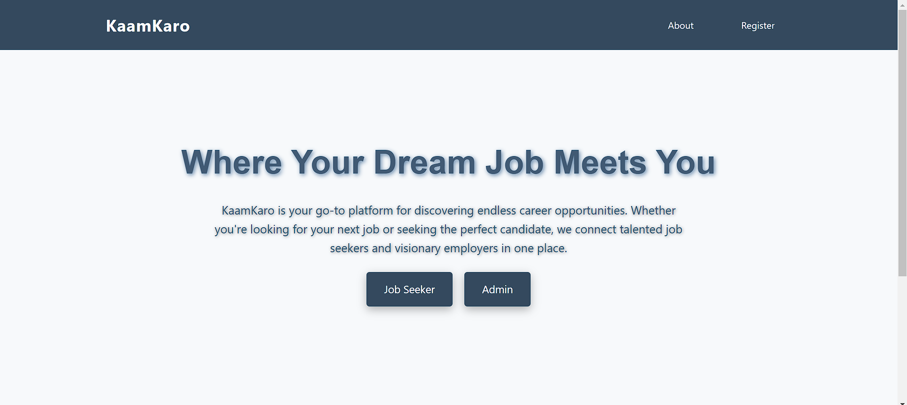
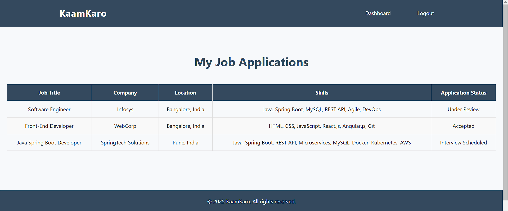
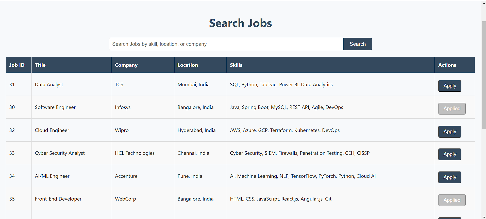
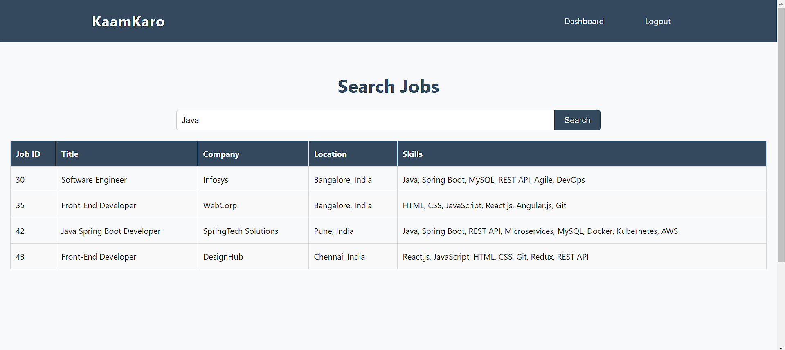
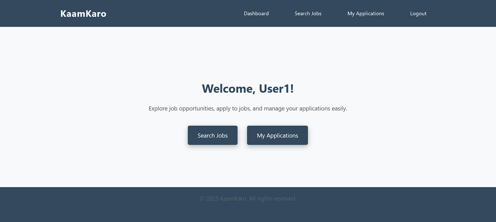
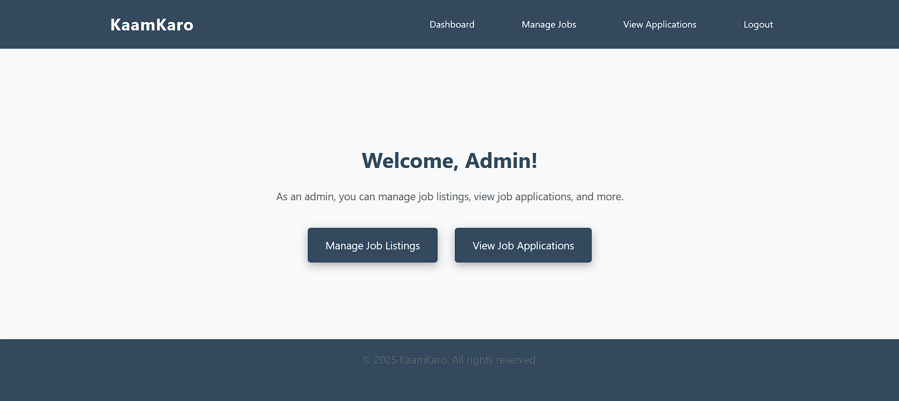
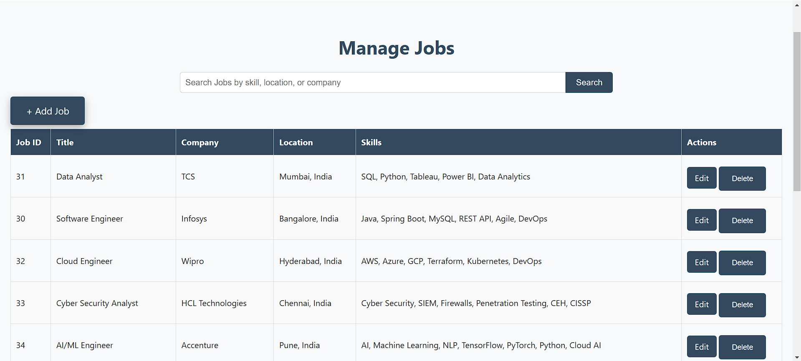
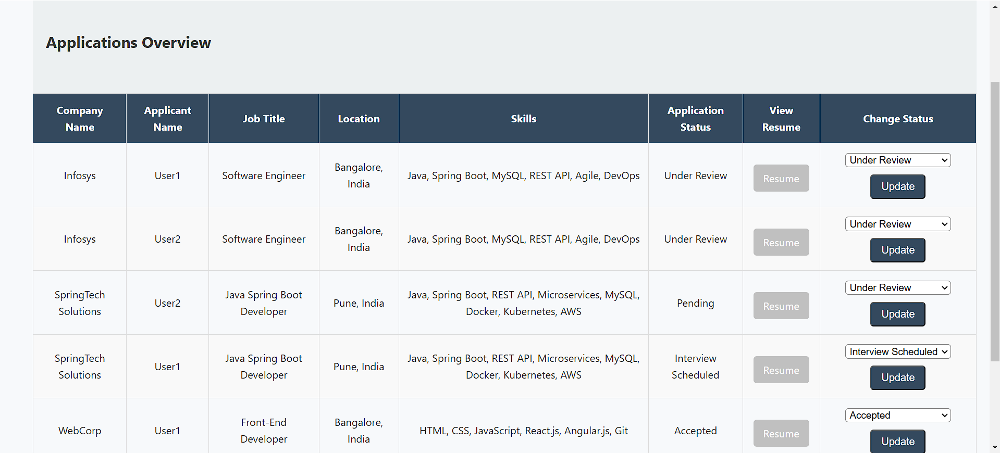

# **KaamKaro - Online Job Portal**  

This is a **web-based Online Job Portal** built using **Java Servlets**, **JSP**, **JDBC**, **Oracle Database**, and **HTML/CSS/JavaScript**, running on an **Apache Tomcat server**. The project follows the **MVC architecture**.

---

## **Features**  

### **User Features:**  
1. **Registration**: Users (Job Seekers) can sign up with their details.  
2. **Login**: Users can log in using their credentials.  
3. **Browse Jobs**: Users can view the list of available job postings.  
4. **Search Jobs**: Users can search jobs based on skills, location, and company.  
5. **Apply for Jobs**: Users can submit applications for jobs they are interested in.  
6. **View Applied Jobs**: Users can check the status of their job applications.  
7. **Logout**: Users can securely log out of the application.  

### **Admin Features:**  
1. **Login**: Admins can log in using their credentials.  
2. **Manage Jobs**: Admins can add, edit, and delete job postings.  
3. **View Applications**: Admins can see applications submitted by job seekers.  
4. **Manage Application Status**: Admins can update the status of job applications (e.g., Pending, Approved, Rejected).  
5. **View Applicant Resumes**: Admins can view the submitted job applications.  
6. **Logout**: Admins can securely log out of the application.  

---

## **Database Schema**  

### **Tables**  

#### **1. `applicant`**  
Stores job seeker details.  

| Column Name  | Null?  | Type          |  
|-------------|--------|---------------|  
| APPLICANT_ID | NOT NULL | NUMBER(38) |  
| USERNAME | NOT NULL | VARCHAR2(50) |  
| EMAIL | NOT NULL | VARCHAR2(100) |  
| PASSWORD | NOT NULL | VARCHAR2(100) |  
| CREATED_AT |  | TIMESTAMP(6) |  

#### **2. `administrator`**  
Stores admin details.  

| Column Name  | Null?  | Type          |  
|-------------|--------|---------------|  
| ADMIN_ID | NOT NULL | NUMBER(38) |  
| USERNAME | NOT NULL | VARCHAR2(50) |  
| EMAIL | NOT NULL | VARCHAR2(100) |  
| PASSWORD | NOT NULL | VARCHAR2(100) |  
| CREATED_AT |  | TIMESTAMP(6) |  

#### **3. `job_listings`**  
Stores job details.  

| Column Name  | Null?  | Type          |  
|-------------|--------|---------------|  
| JOB_ID | NOT NULL | NUMBER(38) |  
| JOB_TITLE | NOT NULL | VARCHAR2(100) |  
| JOB_DESCRIPTION |  | CLOB |  
| JOB_COMPANY |  | VARCHAR2(50) |  
| JOB_LOCATION |  | VARCHAR2(100) |  
| JOB_SKILLS |  | VARCHAR2(255) |  
| JOB_POSTED_DATE |  | TIMESTAMP(6) |  

#### **4. `job_applications`**  
Stores applications submitted by users.  

| Column Name  | Null?  | Type          |  
|-------------|--------|---------------|  
| APPLICATION_ID | NOT NULL | NUMBER(38) |  
| APPLICANT_ID | NOT NULL | NUMBER(38) |  
| JOB_ID | NOT NULL | NUMBER(38) |  
| APPLICATION_STATUS |  | VARCHAR2(50) |  
| APPLICATION_DATE |  | TIMESTAMP(6) |  
| FORM_DATA |  | CLOB |  

---

## **Project Setup**  

### **1. Clone the Repository**  
```bash  
git clone <repository-url>  
cd <repository-folder>  
```  

### **2. Set Up the Database**  
- Import the provided SQL file or manually create the tables mentioned above in Oracle Database.  

### **3. Configure Database Connection**  
- Update the database connection details (URL, username, password) in the `dbConfig.properties` file or directly in the JDBC connection class.  

### **4. Deploy the Application**  
- Copy the project folder to the `webapps` directory of Apache Tomcat.  
- Start the Tomcat server using:  
```bash  
<tomcat-folder>/bin/startup.sh  
```  

### **5. Access the Application**  
- Open a browser and navigate to:  
```  
http://localhost:8080/<project-name>  
```  

---

## **Technology Stack**  

- **Backend**: Java (Servlets, JSP)  
- **Frontend**: HTML, CSS, JavaScript  
- **Database**: Oracle  
- **Server**: Apache Tomcat  

---

## **Project Architecture**  

This project is structured following the **Model-View-Controller (MVC)** design pattern:  

- **Model**: Handles database interactions using JDBC (`JobDAO`, `ApplicantDAO`, `AdminDAO`).  
- **View**: JSP pages for UI (`index.jsp`, `jobs.jsp`, `admin-dashboard.jsp`).  
- **Controller**: Java Servlets handle requests (`JobController`, `AdminController`, `UserController`).  

---

## **How to Use the Application**  

### **As a User (Job Seeker):**  
1. Register an account.  
2. Log in using your credentials.  
3. Browse and search for available jobs.  
4. Apply for jobs.  
5. View your applied job status.  
6. Log out when done.  

### **As an Admin:**  
1. Log in using your credentials.  
2. Add, edit, or delete job listings.  
3. View job applications submitted by users.  
4. Update the application status.  
5. View applicant resumes.  
6. Log out when done.  

---

## **Contribution Guidelines**  

1. Fork the repository.  
2. Create a new branch for your feature or bug fix.  
3. Commit your changes with a descriptive message.  
4. Push to your forked repository.  
5. Create a pull request to the main branch.  

---

## **License**  

This project is licensed under the MIT License. Feel free to use and modify it for your own purposes.  

---

## **Screenshots**  

  
  
  
  
  
  
  
  
